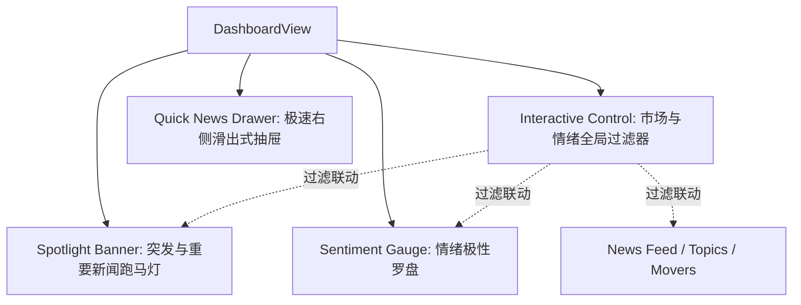

# Enhanced Dashboard 设计规范 (Specs)

## 1. 设计目的

本设计旨在优化系统的前端仪表盘（Dashboard），利用高表现力的视觉模块和直觉式的数据图表，全面展示系统对“新闻监控-情感研判-个股异动”的感知能力。
最核心的优化目标是：**保证突发/高价值新闻能够更好、更快、更显著地引起用户关注，并提供极速、无缝的新闻阅读体验。**

---

## 2. 核心模块与交互设计

我们将在 `DashboardView.vue` 引入以下四大核心升级：

### 模块 A：突发重要快讯雷达（Live Spotlight Banner）
- **视觉风格**：位于页面最上方，窄幅卡片，采用流光渐变边框和呼吸灯动效（`animate-pulse`），配合具有警示感的发光阴影。
- **逻辑**：
  - 自动扫描当前新闻流，找出 12 小时内最重要的新闻（`importance_score >= 8.5`）。
  - 若无，则挑选最近的一条极端情绪新闻（`sentiment_score` 绝对值 > 0.60）。
  - 若均无，则滚动显示市场概览语（“当前市场监控正常，未发现极端负面/重大突发事件”）。
- **交互**：点击快讯标题，直接在当前页面拉起 **右侧抽屉**，直达个股和详细解读。

### 模块 B：情绪极向罗盘（Sentiment Gauge Widget）
- **视觉风格**：大号的半圆形（180度）SVG 指针仪表盘。
- **实现方式**：
  - 采用纯 SVG 构建（无需第三方 Chart 库，零体积和依赖冲突风险），内置平滑的 CSS 旋转过渡效果（`transition-transform`）。
  - **红涨绿跌颜色分配**（A股/港股习惯）：左半弧为偏空区域（浅绿，`var(--negative)`），右半弧为偏好区域（浅红，`var(--positive)`）。
  - 指针位置代表 `利好占比 = positive / (positive + negative)`。
  - 罗盘中心以大字号显示当前比率（如 `72%`），并根据百分比动态配以情绪解读（例如：“**乐观主导 (Bullish)** 政策利好及公司动作频发，建议关注科技及成长股板块”）。

### 模块 C：全局控制与联动面板（Interactive Filter Bar）
- **视觉风格**：设计一排扁平的高级选项卡按钮（全部 / A股 / 港股 / 美股），以及利好/利空快速复选标记。
- **逻辑**：
  - 按钮支持无网络 IO 的 **客户端本地实时过滤**，通过 Computed 计算响应式传递给：
    1. 四个 HeroMetrics（新闻总量、偏利好、偏利空数量及走势折线图同步变化）。
    2. Sentiment Gauge（罗盘实时重新偏转和比例重计）。
    3. News Feed（列表实时只显示对应市场或特定情绪的新闻）。
    4. Topic Board（主题列表自动过滤）。
    5. Movers（自选股异动仅展示对应市场的波动股）。
  - 这让原本静态的四大模块变成了一个极具动态联动生命力的“中央控制台”。

### 模块 D：极速右侧预览抽屉（Quick News Drawer）
- **视觉风格**：右侧滑出式抽屉（Slide-over Panel），宽度约为窗口的 35%-40%。
- **背景**：高斯模糊（`backdrop-filter: blur(16px)`）和暗黑透明终端卡片设计。
- **内容结构**：
  - **基础元数据**：标题、发表时间、源、正文字数、原文链接按钮。
  - **新闻正文**：显示 `ArticleContent` 提取出的完整正文。
  - **AI 研判面板**：显示个股提及、政策/公司动作/产业链/价格异动的归类、建议动作等级。支持在无分析数据时点击“魔棒”一键调用 API 分析并实时回填。
- **交互优势**：
  - 0毫秒路由跳转，保持在 Dashboard 上下文内。
  - 支持顶部“上一篇/下一篇”快速切换，浏览效率提升 10 倍以上。

---

## 3. 设计规范与视觉标记 (Aesthetics)
- **色彩体系**：严格沿用已配置的暗色科技风格。
- **动效微交互**：
  - 过滤器页签切换时滑块背景的平滑移动。
  - 突发快讯的心跳呼吸灯动效。
  - 指针偏转的过渡动效。
  - 抽屉滑入滑出的过渡动画 (`transition: transform 0.3s cubic-bezier(0.16, 1, 0.3, 1)`)。

## 4. 测试与验证点
- 过滤器的响应式联动正确性。
- 指针计算边缘情况（如 positive 和 negative 均为 0 时的兜底处理）。
- 新闻抽屉中正文与 AI 解析加载状态、空态提示，以及“上一篇/下一篇”在过滤后的列表中的正确流转。
